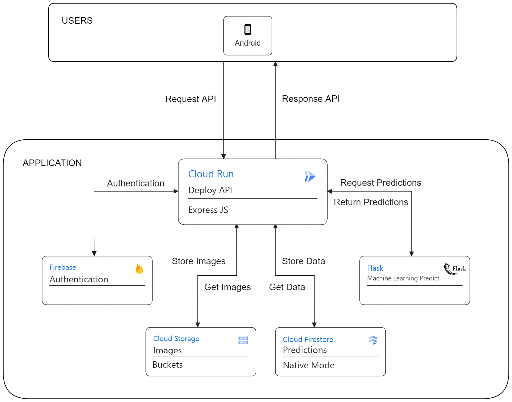

<h1 align="center"> Cloud BirdWatch Documentation </h1>
Welcome to the official documentation for BirdWatch! Here you'll find everything you need to know about integrating, deploying, and utilizing our bird classification system.

## Cloud Architecture
Our architecture leverages Cloud Run for deploying our ML model (Flask) and Backend (Express.js), Cloud Storage for storing user-uploaded photos, and Firestore for persisting prediction results. This setup ensures efficient deployment, scalable storage, and reliable data management to support our application seamlessly.



## Deploying the Application

To deploy the ML Model and Backend, please follow these steps:

### Model ML Deployment
1. Clone the Model repository
   ```bash
   git clone https://github.com/Casptone-BirdWatch/birdwatch-cc.git
   cd birdwatch-cc/Model
   ```
2. Follow the instructions in the Model Documentation for deployment.
### Backend Deployment
1. Clone the Backend repository
   ```bash
   git clone https://github.com/Casptone-BirdWatch/birdwatch-cc.git
   cd birdwatch-cc/Backend
   ```
2. Follow the instructions in the Backend Documentation for deployment.

## API Documentation
Explore our API documentation using the Postman documentation.

You can view the documentation [here](https://documenter.getpostman.com/view/34597337/2sA3XJnRJf).

Feel free to contribute or provide feedback. Happy BirdWatch-ing! 🔍🦅
